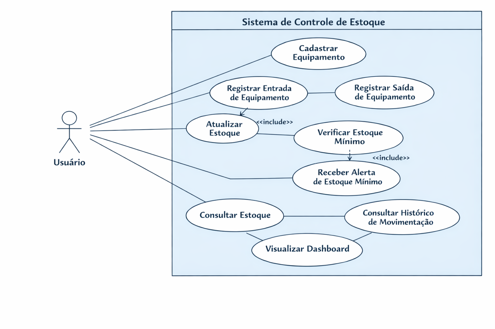
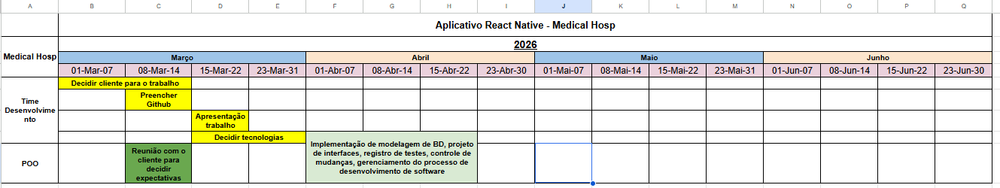

# Especificações do Projeto

Pré-requisitos: <a href="1-Documentação de Contexto.md"> Documentação de Contexto</a>

Nesta parte mostramos o que o app precisa ter, pensando nos usuários da Medical Hosp.

Técnicas usadas:

- **Design Thinking** — pra mapear o problema e as dores do dia a dia.
- **Personas** — perfis dos usuários reais (técnico, estoque, gestor).
- **Histórias de Usuário** — frases simples do que cada um quer fazer.
- **Requisitos Funcionais** — lista das funções principais (cadastro, entradas/saídas, alertas, dashboard).
- **Requisitos Não Funcionais** — fácil de usar, rápido, seguro e dentro das limitações do projeto.

## Personas

### Persona 1 – Leandro Silva

Idade: 25 anos.

Papel: Técnico de Engenharia Clínica.

Contexto: Realiza calibrações em hospitais. Precisa conferir se os seus próprios instrumentos (padrões) estão válidos antes de iniciar um serviço.

Dor: Perde tempo procurando certificados em papel ou pastas digitais bagunçadas e precisa fazer cálculos de força G manualmente, o que gera insegurança nos resultados.

### Persona 2 – Alberto Martins

Idade: 36 anos.

Papel: Engenheiro Clínico.

Contexto: Responsável por garantir que nenhum padrão vença e por homologar os fornecedores que calibram os equipamentos da Medical Hosp.

Dor: Dificuldade em gerenciar o histórico de equipamentos desativados e em localizar rapidamente o contato de fornecedores específicos para cada tipo de grandeza.
>

## Histórias de Usuários

Com base na análise das personas forma identificadas as seguintes histórias de usuários:

|EU COMO... `PERSONA`| QUERO/PRECISO ... `FUNCIONALIDADE` |PARA ... `MOTIVO/VALOR`                 |
|--------------------|------------------------------------|----------------------------------------|
|Técnico  | Cadastrar novos padrões com TAG e Série           | Manter o inventário de instrumentos atualizado.             |
|Técnico       | Visualizar o histórico de calibração e o PDF do certificado               | Comprovar a rastreabilidade metrológica ao cliente final. |
|Técnico      | Calcular a Força G automaticamente informando RPM e Raio           | Eliminar erros matemáticos e agilizar o teste de centrífugas. |
|Coordenador       | Cadastrar fornecedores (nome, telefone, portal)           | Centralizar o contato com os laboratórios parceiros. |
|Gestor       | Visualizar um dashboard de status (Válido/Vencido)          | Antecipar o envio de padrões para calibração externa. |
|Coordenador       | Desativar um padrão registrando o motivo         | Manter o histórico de descarte para auditorias futuras. |

## Requisitos

As tabelas que se seguem apresentam os requisitos funcionais e não funcionais que detalham o escopo do projeto. Para determinar a prioridade de requisitos, aplicar uma técnica de priorização de requisitos e detalhar como a técnica foi aplicada.

### Requisitos Funcionais

|ID    | Descrição do Requisito  | Prioridade | Responsável |
|------|-----------------------------------------|----| ----|
|RF-001| Cadastrar padrões (Nome, Marca, Modelo, TAG, Série, Estado)  | ALTA | Helena Edim |
|RF-002| Listar fornecedores com informações de contato e link de portal. | MÉDIA | Gabriel |
|RF-003| Visualizar dados da última calibração e histórico completo em PDF. | ALTA | Lucas Gabriel |
|RF-004| Calculadora de Força G (Entradas: RPM e Raio; Saída: RCF).| ALTA | Arthur |
|RF-005| Dashboard de status: Válido, Atenção (próximo ao vencimento) e Vencido. | MÉDIA | Lucas Gabriel |
|RF-006| Módulo de Desativados: Registro de baixa com justificativa técnica.| MÉDIA | Helena Edim |
|RF-007| Busca de padrões por TAG, Patrimônio ou Número de Série. | ALTA | Gabriel |
|RF-008| Filtro de padrões por status de calibração. | MÉDIA | Arthur |
|RF-009| Notificar o usuário quando a calibração estiver a 1 mês de vencer. | MÉDIA | Lucas |

### Requisitos não Funcionais

|ID     | Descrição do Requisito  |Prioridade |
|-------|-------------------------|----|
|RNF-001| O sistema deve ser responsivo para rodar em um dispositivos móveis | ALTA | 
|RNF-002| O tempo de resposta do sistema não deve exceder 5s para exibir páginas em consultas em uso normal |  MÉDIA |
|RNF-003| O cálculo de Força G deve ser processado em tempo real (< 3s). |  ALTA |
|RNF-004| Visualização de certificados PDF integrada ao app (sem download externo). |  BAIXA |
|RNF-005| O sistema deve estar em conformidade com a Lei Geral de Proteção de Dados (LGPD). |  BAIXA |
|RNF-006| Conformidade visual com a paleta de cores institucional da Medical Hosp. |  BAIXA |

Com base nas Histórias de Usuário, enumere os requisitos da sua solução. Classifique esses requisitos em dois grupos:

- [Requisitos Funcionais
 (RF)](https://pt.wikipedia.org/wiki/Requisito_funcional):
 correspondem a uma funcionalidade que deve estar presente na
  plataforma (ex: cadastro de usuário).
- [Requisitos Não Funcionais
  (RNF)](https://pt.wikipedia.org/wiki/Requisito_n%C3%A3o_funcional):
  correspondem a uma característica técnica, seja de usabilidade,
  desempenho, confiabilidade, segurança ou outro (ex: suporte a
  dispositivos iOS e Android).
Lembre-se que cada requisito deve corresponder à uma e somente uma
característica alvo da sua solução. Além disso, certifique-se de que
todos os aspectos capturados nas Histórias de Usuário foram cobertos.

## Restrições

O projeto está restrito pelos itens apresentados na tabela a seguir.

|ID| Restrição                                             |
|--|-------------------------------------------------------|
|01| O projeto deverá ser entregue até o final do semestre |
|02|  O serviço de API desenvolvido em ASP.NET Core  deve seguir rigorosamente o padrão MVC (Model
View-Controller). |
|03| O sistema de visualização de PDF depende da conectividade para carregar arquivos da nuvem ou armazenamento local.       |

## Diagrama de Casos de Uso

O diagrama de casos de uso é o próximo passo após a elicitação de requisitos, que utiliza um modelo gráfico e uma tabela com as descrições sucintas dos casos de uso e dos atores. Ele contempla a fronteira do sistema e o detalhamento dos requisitos funcionais com a indicação dos atores, casos de uso e seus relacionamentos. 

As referências abaixo irão auxiliá-lo na geração do artefato “Diagrama de Casos de Uso”.

> **Links Úteis**:
> - [Criando Casos de Uso](https://www.ibm.com/docs/pt-br/elm/6.0?topic=requirements-creating-use-cases)
> - [Como Criar Diagrama de Caso de Uso: Tutorial Passo a Passo](https://gitmind.com/pt/fazer-diagrama-de-caso-uso.html/)
> - [Lucidchart](https://www.lucidchart.com/)
> - [Astah](https://astah.net/)
> - [Diagrams](https://app.diagrams.net/)

# Matriz de Rastreabilidade

A matriz de rastreabilidade é uma ferramenta usada para facilitar a visualização dos relacionamento entre requisitos e outros artefatos ou objetos, permitindo a rastreabilidade entre os requisitos e os objetivos de negócio. 

A matriz deve contemplar todos os elementos relevantes que fazem parte do sistema, conforme a figura meramente ilustrativa apresentada a seguir.

> **Links Úteis**:
> - [Artigo Engenharia de Software 13 - Rastreabilidade](https://www.devmedia.com.br/artigo-engenharia-de-software-13-rastreabilidade/12822/)
> - [Verificação da rastreabilidade de requisitos usando a integração do IBM Rational RequisitePro e do IBM ClearQuest Test Manager](https://developer.ibm.com/br/tutorials/requirementstraceabilityverificationusingrrpandcctm/)
> - [IBM Engineering Lifecycle Optimization – Publishing](https://www.ibm.com/br-pt/products/engineering-lifecycle-optimization/publishing/)

# Gerenciamento de Projeto

De acordo com o PMBoK v6 as dez áreas que constituem os pilares para gerenciar projetos, e que caracterizam a multidisciplinaridade envolvida, são: Integração, Escopo, Cronograma (Tempo), Custos, Qualidade, Recursos, Comunicações, Riscos, Aquisições, Partes Interessadas. Para desenvolver projetos um profissional deve se preocupar em gerenciar todas essas dez áreas. Elas se complementam e se relacionam, de tal forma que não se deve apenas examinar uma área de forma estanque. É preciso considerar, por exemplo, que as áreas de Escopo, Cronograma e Custos estão muito relacionadas. Assim, se eu amplio o escopo de um projeto eu posso afetar seu cronograma e seus custos.

<!--
## Gerenciamento de Tempo

Com diagramas bem organizados que permitem gerenciar o tempo nos projetos, o gerente de projetos agenda e coordena tarefas dentro de um projeto para estimar o tempo necessário de conclusão.

O gráfico de Gantt ou diagrama de Gantt também é uma ferramenta visual utilizada para controlar e gerenciar o cronograma de atividades de um projeto. Com ele, é possível listar tudo que precisa ser feito para colocar o projeto em prática, dividir em atividades e estimar o tempo necessário para executá-las.

-->

## Gerenciamento de Equipe

O gerenciamento adequado de tarefas contribuirá para que o projeto alcance altos níveis de produtividade. Por isso, é fundamental que ocorra a gestão de tarefas e de pessoas, de modo que os times envolvidos no projeto possam ser facilmente gerenciados. 

## Gestão de Orçamento

O processo de determinar o orçamento do projeto é uma tarefa que depende, além dos produtos (saídas) dos processos anteriores do gerenciamento de custos, também de produtos oferecidos por outros processos de gerenciamento, como o escopo e o tempo.

|Recursos Necessários    | Custo Estimado (R$)  | Descrição e Justificativa |  |
|------|-----------------------------------------|----| ----|
|Recursos humanos| 200.000,00  | Custos com a equipe de desenvolvimento (desenvolvedores React Native, .NET, designers UI/UX), incluindo salários, encargos sociais e benefícios durante o período de execução do projeto. |  |
|Hardware| 25.000,00 | Investimento em computadores de alto desempenho para a equipe de desenvolvimento, servidores de teste, e dispositivos móveis para a realização de testes em ambientes Android e iOS. |  |
|Rede| 2.400,00 | Custos relacionados à infraestrutura de rede, incluindo internet de alta velocidade para a equipe, serviços de hospedagem inicial e largura de banda para transferências de dados. |  |
|Software| 24.000,00| Licenças de ferramentas de desenvolvimento (IDE, ferramentas de design, bibliotecas comerciais), licenças de sistemas operacionais, serviços de nuvem (Cloud Services) e ambientes de banco de dados. |  |
|Serviços| 5.000,00 | Contratação de serviços de terceiros, como consultoria especializada em segurança da informação (LGPD), auditoria de código, treinamento para a equipe e emissão de certificados digitais. |  |
|TOTAL| 256.400,00| Soma total do investimento necessário para a execução do projeto. | |

