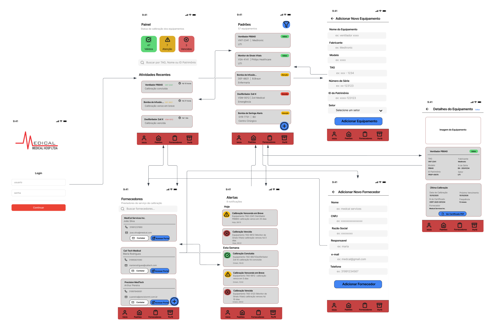
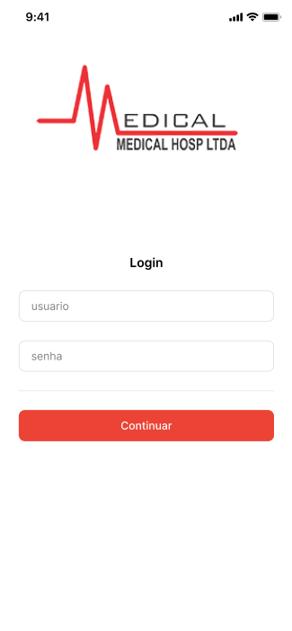
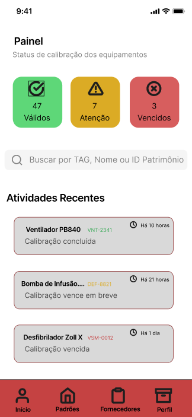
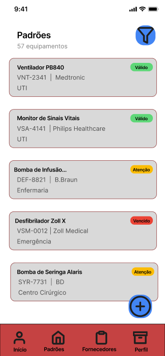
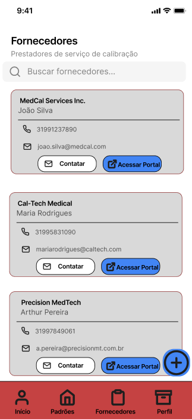
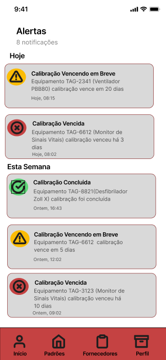
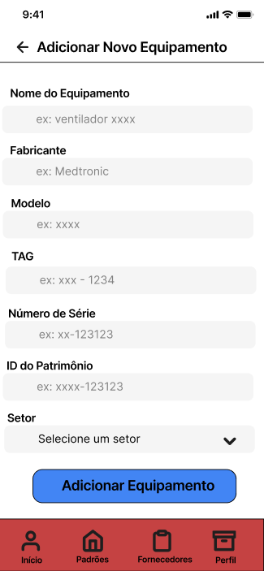
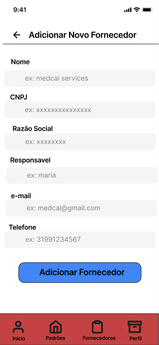
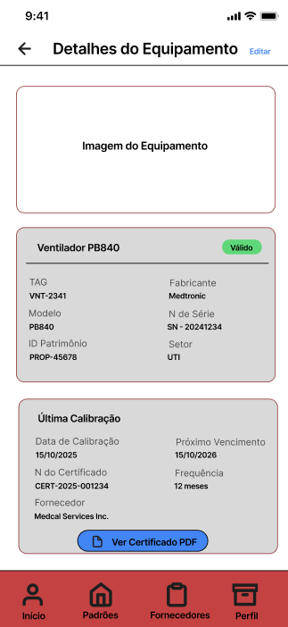

# Projeto de Interface

## Diagrama de Fluxo

O diagrama apresenta o estudo do fluxo de interação do usuário com o sistema interativo e  muitas vezes sem a necessidade do desenho do design das telas da interface. Isso permite que o design das interações seja bem planejado e gere impacto na qualidade no design do wireframe interativo que será desenvolvido logo em seguida.

<!--
# 
#
# As referências abaixo irão auxiliá-lo na geração do artefato “Diagramas de Fluxo”.
# > **Links Úteis**:
# > - [Fluxograma online: seis sites para fazer gráfico sem instalar nada | Produtividade | TechTudo](https://www.techtudo.com.br/listas/2019/03/fluxograma-online-seis-sites-para- # fazer-grafico-sem-instalar-nada.ghtml)

-->

## Wireframes

### Login

### Inicio/Painel

### Padrões/Estoque

### Fornecedores

### Perfil

### Adicionar Equipamento

### Adicionar Fornecedor

### Detalhes Equipamentos

 
> **Links**:
> - [Link do Protótipo Interativo](https://www.figma.com/proto/Pxn80rXluX4YesUweUCFZj/Sem-t%C3%ADtulo?node-id=0-1&t=B9y6w4fjQY97tCoS-1)

