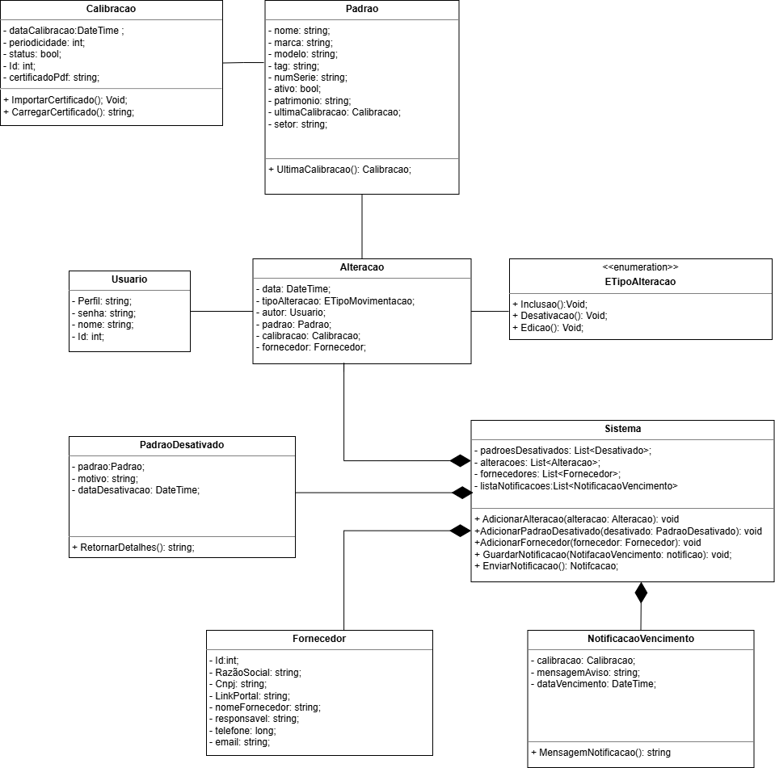
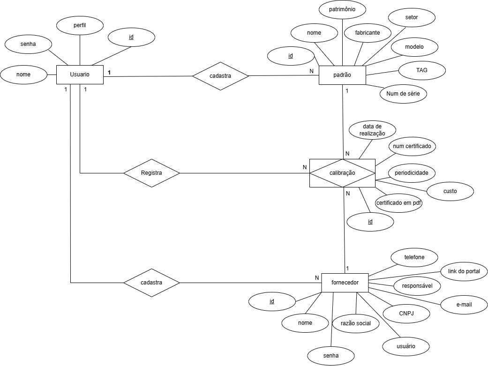
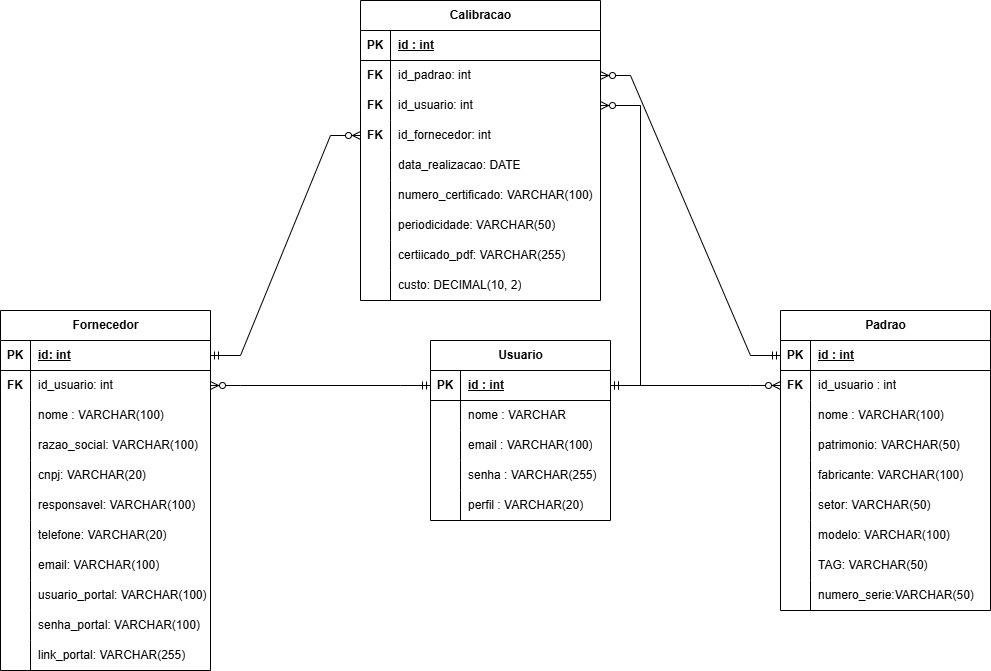
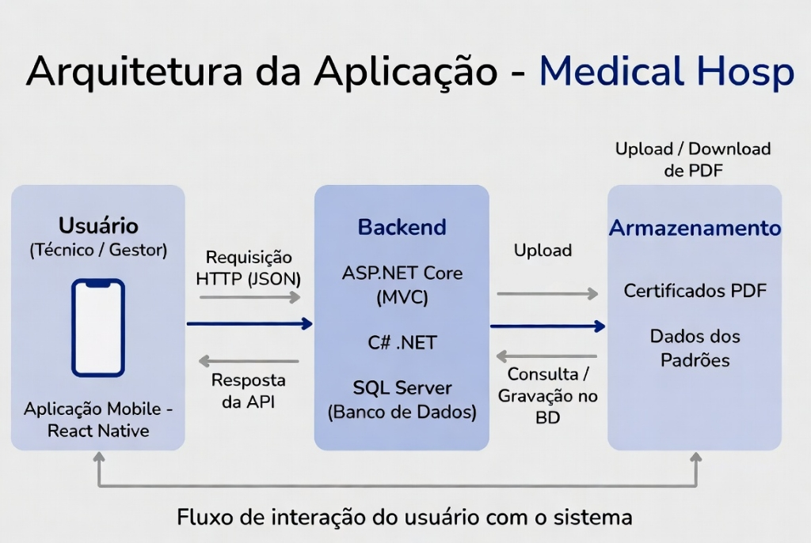

# Arquitetura da Solução

Pré-requisitos: <a href="3-Projeto de Interface.md"> Projeto de Interface</a>

Definição de como o software é estruturado em termos dos componentes que fazem parte da solução e do ambiente de hospedagem da aplicação.

## Diagrama de Classes

O diagrama de classes ilustra graficamente como será a estrutura do software, e como cada uma das classes da sua estrutura estarão interligadas. Essas classes servem de modelo para materializar os objetos que executarão na memória.

As referências abaixo irão auxiliá-lo na geração do artefato “Diagrama de Classes”.

> - [Diagramas de Classes - Documentação da IBM](https://www.ibm.com/docs/pt-br/rational-soft-arch/9.6.1?topic=diagrams-class)
> - [O que é um diagrama de classe UML? | Lucidchart](https://www.lucidchart.com/pages/pt/o-que-e-diagrama-de-classe-uml)

## Modelo ER

O Modelo ER representa através de um diagrama como as entidades (coisas, objetos) se relacionam entre si na aplicação interativa.]

## Esquema Relacional

O Esquema Relacional corresponde à representação dos dados em tabelas juntamente com as restrições de integridade e chave primária.

## Modelo Físico

Entregar um arquivo banco.sql contendo os scripts de criação das tabelas do banco de dados. Este arquivo deverá ser incluído dentro da pasta src\bd.

## Tecnologias Utilizadas

As tecnologias utilizadas são:

- Repositório de Código: GitHub
- Editor de Código: Visual Studio (instalado localmente)
- Desenvolvimento Mobile: React Native
- Backend e APIs: C# .NET (ASP.NET Core) – seguindo rigorosamente o padrão MVC (Model-View-Controller)
- Banco de Dados: SQL Server (backend)
- Comunicação da Equipe: Discord
- Gerenciamento de Projeto: GitHub Projects (Kanban)
- Design de Telas (UI/UX): Figma

## Hospedagem

Explique como a hospedagem e o lançamento da plataforma foi feita.

> **Links Úteis**:
>
> - [Website com GitHub Pages](https://pages.github.com/)
> - [Programação colaborativa com Repl.it](https://repl.it/)
> - [Getting Started with Heroku](https://devcenter.heroku.com/start)
> - [Publicando Seu Site No Heroku](http://pythonclub.com.br/publicando-seu-hello-world-no-heroku.html)

## Qualidade de Software

A norma internacional ISO/IEC 25010, que é uma atualização da ISO/IEC 9126, define oito características e 30 subcaracterísticas de qualidade para produtos de software.
Com base nessas características e nas respectivas sub-características, foram identificadas as sub-características que se adequam ao sistema MedicalHosp.

#### Subcaracterísticas de qualidade selecionadas:

- Functional completeness: A equipe levantou juntou aos stakeholders todos os fluxos, requisitos e funcionalidades a serem implementadas no MedicalHosp, garantido alta adequação funcional e conformidade com as necessidades do cliente.
- Learnability: O MedicalHosp foi desenvolvido com foco na simplicidade e intuitividade da interface, permitindo que técnicos e gestores hospitalares dominem rapidamente o uso da ferramenta, reduzindo a necessidade de treinamentos extensos e acelerando a adoção do sistema.
- Operability: O sistema é uma ferramenta também de fácil operação e de muita utilidade para os técnicos e gestores que interagem com o sistema, sendo uma ferramente de gestão e controle que permite o uso de funcionalidades que agregam diretamente para a operabilidade dos funcionários.
- Resource utilization: O sistema sistema gerencia os recursos médicos de forma eficiente e segura, evitando a ausência de padrões calibrados e promovendo a conformidade dos equipamentos com os requisitos estabelecidos, contribuindo para a segurança e disponibilidade dos padrões.
- User assistance: O sistema conta com uma funcionalidade de notficação de padrões próximos ao vencimento e de uma lista dessas notificações para auxiliar o usuário a agir de forma preventiva e evitar o vencimento de calibrações.

> **Links Úteis**:
>
> - [ISO/IEC 25010:2011 - Systems and software engineering — Systems and software Quality Requirements and Evaluation (SQuaRE) — System and software quality models](https://www.iso.org/standard/35733.html/)
> - [Análise sobre a ISO 9126 – NBR 13596](https://www.tiespecialistas.com.br/analise-sobre-iso-9126-nbr-13596/)
> - [Qualidade de Software - Engenharia de Software 29](https://www.devmedia.com.br/qualidade-de-software-engenharia-de-software-29/18209/)
